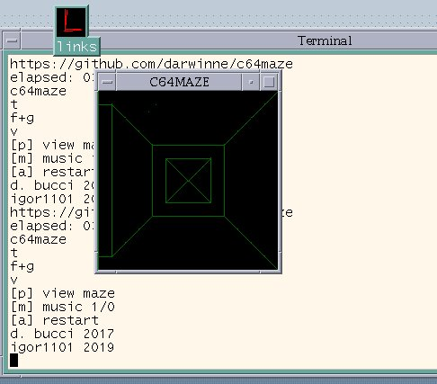

# C64maze
A 3D maze game written in C.

This project (distributed with the GPLv.3 license) is a very simple 3D maze originally written for
the Commodore 64 computer, hence the name, and then ported to UNIX. The source code is written in C (with some inline
assembly for the C64 version) and it is meant to be compiled with the cc65 compiler or gcc with the SDL2 library.

The game started as an exercise in high resolution graphics on the C64 and was inspired to those old 3D maze games in BASIC that were popular at the time. However, the C language is much faster than BASIC and one can do some pretty nice things. Some routines are tweaked in assembly for better performances.

The goal of the game is to find the exit of the maze in the shortest possible amount of time. The entrance of the maze is changed randomly each time the game is played. You can have a look at the maze map, but beware! Each time this is done, a penalty of 30s is applied:

You should explore the maze to find the exit:

And once you find your way through it, you will know how much time you needed:

Here is a screenshot of the game running on a Unix machine:

The music is a 3-part reduction for the SID of J.S. Bach's "little" fugue in G minor, BWV578. Hommage to Wendy Carlos. The music driver is fully interrupt-driven and it is also written in C.
